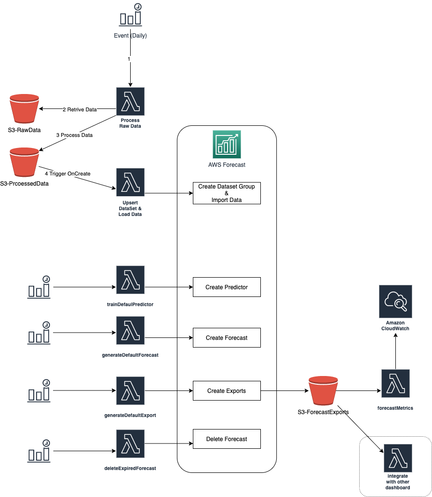
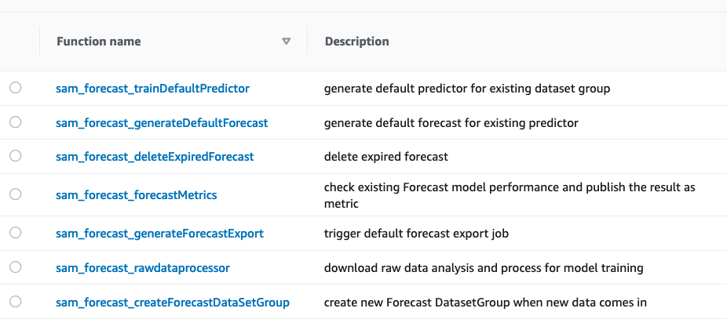
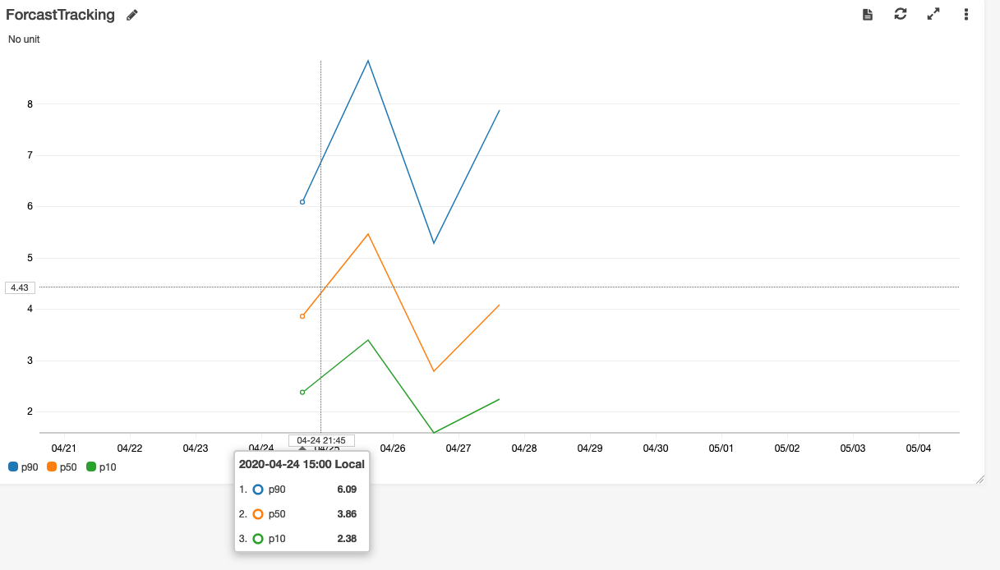

# Amazon Forecast Continuous Training Demo

A demo of using Amazon Forecast AI service to continuously training model and generating forecast as new data comes in. It will be easy to setup in any AWS account, run through the whole forecast cycle including,

1. Data Collection, processing
2. Trigger the model training
3. Generate Forecast
4. Monitor Model Performance
5. The exported csv can be further used to integrate with existing dashboards (like grafana)

Currently the demo is using the AWS COVID19 public data lake raw data (states daily positive cases, refreshed everyday).

https://covid19-lake.s3.us-east-2.amazonaws.com/rearc-covid-19-testing-data/csv/states_daily/states_daily.csv

## Architecture Diagram

The forecast raw data processing logic will be triggered everyday by picking up the raw data from public data lake, the trained forecast model will be used to forecast number of positive cases by state ; the demo also provide a way to keep reviewing the performance of the forecast model by comparing with real historical data ; model performance will be published as metrics and can be viewed using cloudwatch dashboard.

## Deploy the Demo

Download and deploy the cfn-forecast-demo-pipeline.yml

*  When you deploy the cloudformation template, you will create a codebuild project, and the project will deploy all the 6 lambda functions used in this demo.

1. sam_forecast_rawdataprocessor
> This function will be triggered every day to pull the raw data from public data lake, transform the source data into the ready-to-use training dataset by forecast. At the same time, the raw data processor will also transform the raw data into a format that can be easily used to compare with forecast export to evaluate the model performance in the future.

2. sam_forecast_createForecastDataSetGroup
> This is the function triggered by S3 bucket notification (when there's new ready-to-use training data comming in).

3. sam_forecast_trainDefaultPredictor
> This is the function triggered everyday, it will check if the default predictor exist for each of dataset group (using naming convention). If not, it will trigger the predictor training.

4. sam_forecast_generateDefaultForecast
> This is the function triggered everyday, it will check if the default forecast exist for each of dataset group (using naming convention). If not, it will trigger the forecast generating.

5. sam_forecast_generateForecastExport
> This is the function triggered everyday, it will check if the default forecast export exist for each of dataset group (using naming convention). If not, it will trigger the forecast export.

6. sam_forecast_forecastMetrics
> This is the function triggered everyday, it will check if there's new forecast export being generated. If yes, it will check if the export has corresponding real history data (generated by sam_forecast_rawdataprocessor ), if there's real data , it will compare the real data with forecast data, calculate a summed gap percentage used to evaluate the model performance and publish the metrics to cloudwatch.

7. sam_forecast_deleteExpiredForecast
> This is the function triggered every 4 hours, it will check against total numbers of forecast you want to keep, if it exceeded the configured number, the function will try to delete the oldest forecast.
> Please check for forecast service limit for number of forecast you can reserve,
https://docs.aws.amazon.com/forecast/latest/dg/limits.html

*  The cfn-forecast-demo-pipeline.yml  will also create a dashboard in cloudwatch, which is used to monitor the model prediction performance. Here's how the dashboard looks like,

